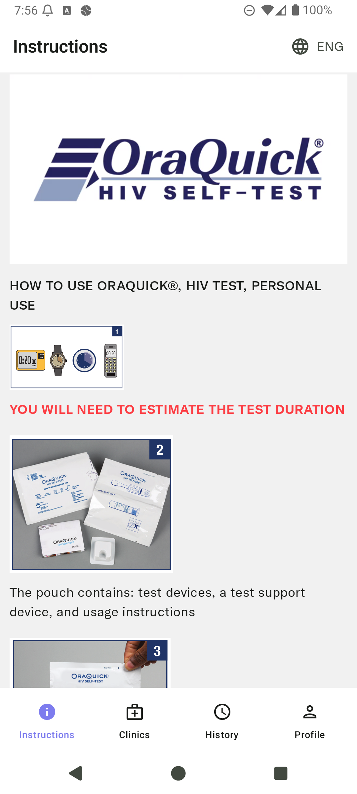
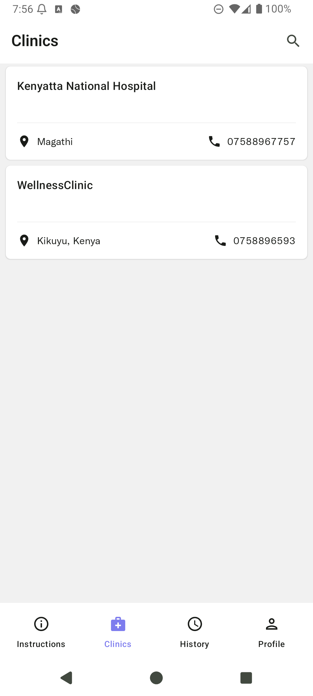
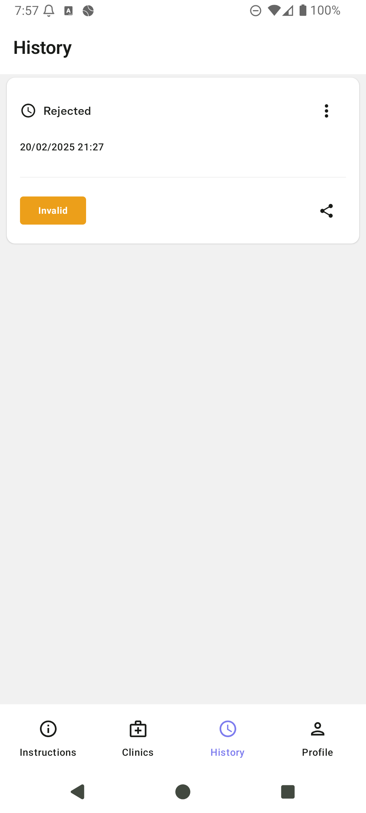
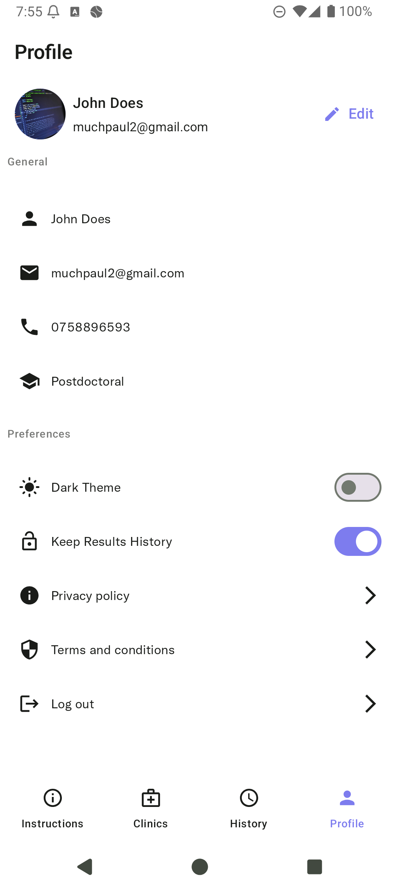

# Smart Test

**Smart Test** is an Android app that empowers users to manage their HIV testing journey with ease, privacy, and access to information. Users can securely upload their HIV test results and receive feedback directly through the app. Smart Test also provides educational materials to help users stay informed about HIV prevention, treatment, and care.

Built using modern Android technologies including **Jetpack Compose**, **Dagger Hilt**, and **Ktor**, Smart Test is designed to be lightweight, intuitive, and secure.

---

## Features

- 📤 **Upload HIV Test Results** – Easily upload and track your HIV test results.
- ✅ **Get Results Securely** – Receive and view your test results within the app.
- 📚 **Educational Materials** – Access a library of up-to-date resources about HIV.
- 🔒 **Privacy First** – Your data stays secure and confidential.

---

## 🛠️ Built With

- [Jetpack Compose](https://developer.android.com/jetpack/compose) – Modern UI toolkit for native Android.
- [Dagger Hilt](https://dagger.dev/hilt/) – Dependency injection for clean architecture.
- [Ktor Client](https://ktor.io/docs/client.html) – HTTP client for seamless communication with backend APIs.
- [Kotlin](https://kotlinlang.org/) – Primary language for app development.

---

## Getting Started

### Prerequisites

- Android Studio latest version
- Minimum SDK: **API 23**
- Kotlin version: **2.0.0**
- Internet connection (to fetch/upload test results)

### Setup Instructions

1. **Clone the Repository**

```bash
git clone https://github.com/CharlesMuchogo/Smart_Test

cd Smart_Test
```

2. **Open in Android Studio**

    - Open Android Studio.
    - Select "Open an existing project".
    - Navigate to the cloned directory and select it.

3. **Build and Run**

    - Connect your Android device or use an emulator.
    - Click **Run ▶️** in Android Studio.

---

## Screenshots

<p align="center">
 
 
 

</p>

## Learn More

For more info about HIV and testing:

- [CDC – HIV Basics](https://www.cdc.gov/hiv/basics/index.html)
- [UNAIDS](https://www.unaids.org/en)

---

## Contributing

Pull requests are welcome. For major changes, please open an issue first to discuss what you’d like to change.
